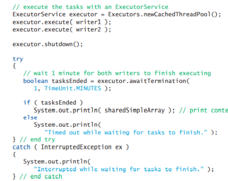

## Threading
## Difference between Process and Thread
1. A process is an instance of a program being executed, A process has its own resources like memory, threads etc..
    - Operating System is responsible for allocating these resources to the process
2. A Thread is a lightweight process - Similarly, A Thread is the smallest sequence of instructions executed by a CPU independantly. 
- A process can have multiple threads, Initially, a Process may have one thread, which is called ** Main Thread **
## Understanding Processes and Threads
- With Respect to Java, The JVM acts as an operating system to allocate resources to its mini- processes.
- Multi- threading allows a program to perform multiple tasks at the same time
- Threads from the same process share the same resources
- Multi-tasking and Multi-threading -- Need to recheck this..
- To call a new thread 
```Java 
Thread thread = new Thread();
thread.start();
//The rest of the code Here
```
- There are more than four ways to create and instantiate a Java Thread
1. Creating a subclass that extends to Thread, Whereby you will override the runnable method, Example:
```Java
public class ThreadEg{
    public static class MyThread extends Thread{
    public void run(){
        System.out.println("The Thread is running");
    }
    }
    public static void main(String[] args){
        MyThread thread = new MyThread();
        thread.start();
    }
}
```
- Example 2: Using the runnable extention: 
```Java
public class ThreadEg{
    public static class MyThread implements Runnable {
        @Override
    public void run(){
        System.out.println("The Thread is running");
    }
    }
    public static void main(String[] args){
        MyThread thread = new MyThread(new MyThread());
        thread.start();
    }
}
```
- Example 3 : Creating an unknown class of Runnable inside the main function
- Example 4 : Using the Lambda expressions
```Java
public class ThreadEg{
  
    }
    public static void main(String[] args){
        Runnable runnable = () -> {
            System.out.println("This is a test using Lambda functions")
        };
        MyThread thread = new MyThread(runnable);
        thread.start();
    }
}
```
- To get the name of the Thread that is currently executing, You can use the code :
```Java 
Thread.currentThread().getName();
```
- To Pause a thread from executing or to sleep a thread :
```Java
try{
    Thread.sleep(2000); //Sleep for 2 seconds and then continue
}
catch(error){
    //Code here
}

```

- To ensure synchrinised access to variables and function calls, the prefix 'Synchronise' is used. This is used when the code has a critical resource or section that may be utilised by multple threads
## Background 
- Concurrency in Computers
Performing several tasks in parallel or concurrently 
Concurrency refers to performing more than one task at the same time (using a single processor or multi-processor). Concurrency involves the usage of Context switching to be efficient. In concurrency - Only one process or Thread is executing per time whereas is parallelism, two or more processes or Threads are executing at the same time
Paralellism - 
Program - Sets of Instructions that can be executed by a computer, or Collection of Algorithms + Data. 
<!-- Process - could also be called an  -->
1. Multi - threading 
- A program with multiple threads of execution, Whereby each thread has its own method call stack and program counter enabking it to execute  concurrently with other threads while sharing the data and the memory of the main process.
- A thread is a sub-process in a way that it has the characteristics of a process
-
1.1 Challenges of multi-threaded programming
- Synchronisation - Ensuring that the data accessed by the multiple threads is thread-safe ensuring that the data is consistent process-wide.
- Dead - locks - When two or more processes are blocked from running, because they are waiting for a common resource to be released.
- Data consistency - When you have mutliple threads manipulating the same data, We need to ensure that the data across all the threads is synchronised.
- Race Conditions - When two processes or threads are trying to access the common resources at the same time
- Starvation - When Dead-lock occurs, the running threads are halted because they are waiting to get a resource that they expect. This causes starvation to the processes that are waiting to be executed.
- Debugging - The human brain is not designed to think in a parallel manner, so if the code runs concurrently, it starts getting harder to debug
- Determining what tasks should be divided for  multi-threading is relatively harder
1.2 Benefits of Multi-threaded programming
- Improved efficiency and Faster computation
## Thread state
- A thread could be in one of the following state: 
1. Runnable - In this state, a thread is ready to be executed by the CPU  
    - Running state - The state is currently being executed by the CPU 
2. Waiting - In this state, the thread is currently waiting for an event to happen, Example includes an I/O input etc. This could be 
3. Timed waiting - This state is when a Thread is waiting for a resource that is currently unavailable, this thread will wait up until the resource is available, if the resource or event hasn't occured, then the thread is pre-empted or removed from the cpu up until the resource is available
4. Blocked - In this state, The Thread is placed on a sleeping mode for a specific amount of time. Example : `Thread.sleep(n.seconds)`. Waiting for a resource that is currently being executed by other threads, like a common variable, so the thread is blocked at this point up until the variable is available
5. Terminated - a Thread has completed a task
- Dispatching thread - Assigning a thread to a processor, Allocating the resources to a thread.
- Thread scheduling - The procedure that the OS takes to decide which thread should be given the CPU time
6. A thread can be moving from running and ready multiple times, the reason is because, the thread may not finish executing when it is given the resources, the Thread may be given a quantum or time - slice, if the time slice expires then the thread has to move back to the ready queue.
## Thread Scheduling
- An OS's Thread Scheduler determines the Thread with the highest priority
- Thr Algorithm that allows time slicing is called Round Robin, Which is used by Most of the Operating Sytstem. This enables threads of equal priority to share the processor.
- When a thread with a higher priority is in the ready state, it can preempt or remove the threads that are currently executing
- Indefinate postponement/ starvation - When higher priority threads keep on preempting lower priority threads, leading to a longer waiting time of lower priority threads
- Aging - This is a technique used to prevent Starvation.

## Using the Executor Framework 
- The Executor is responsible for Creating and managing Threads (Thread pool)
- The executor accepts an argument of Runnable, which the executor assign to the available threads to.
- The executor Framework is recommended for custom made threads to properly manage threads.
- Each thread has a code that it should execute, this code is enclosed under the `run()` method , and the `run()` method is declared under the Interface `Runnable`, So, each thread should implement Runnable
- Difference between Interface and Class -
    - An Interface <i>declares</i> abstract method/operations
    - Class Defines the attributes and methods /operations (Concrete)
    - Abstract classes and Concrete method
## Thread Syncing
- Ensuring that there is an exclusive access to shared data, to allow only one thread to access the data each time
- When one thread has an exclusive acces to the data, then other threads will not have access to that data. This is usually called Mutual Exclusion
### Synchronisation using Monitors
+ Every Object has a monitor and a monitor lock, This lock can only be held by one thread.  
- To modify an object, the thread has to acquire a lock through the Monitor locks as follows
- To Implement Monitor: 
```Java
synchronized (object){
    //Statement
}
```
- Releasing of locks are automatic as soon as the closing curly brace is reached, meaning that the thread is done executing
- If you do not want to implement the runnable, Use the Executor 
```Java
import java.util.*;
public class Main{
    public void Task1(args){
        //Complete task 1
    }
    public void Task2(args){
        //Complete task 2
    }
    public static void main(String[] args){
        ExecutorService executor = new Executors.newCachedThreadPool();
        executor.execute(Task1);
        executor.execute(Task2);
        executor.shutdown(); // ensures that the threads are shutdown once they have completed the task.
    }
}
```
- The `executor.shutdown();` does not really stop threads from executing, but it signals the running threads to stop their execution and also allows the executor to not accept any further tasks. Therefore 

### Thread safety by Default v.s Thread Safety by design
- Thead safety refers to a shared resource. 
- The buffer allows for a specific number of data to be stored over a specific time period,  sometimes the buffer may over-flow whereby the memory is exhausted, here we need to stop writing to the buffer to prevent data loss
    - Thread safety by Default - Refers to the Multithreading library providing management resources for the programmer
    - Thread safety by design - The Designer or programmer has to explicitly design safety measures 
- Normally, the designer has to manually design the thread safety to the threads to ensure syncing 
- Atomic Operations - Sequence of instructions that cannot be interrupted when executing or cannot be done by two threads at the same time


## Test scoping -
 - Everything not covered on test 1, excluding Threading.